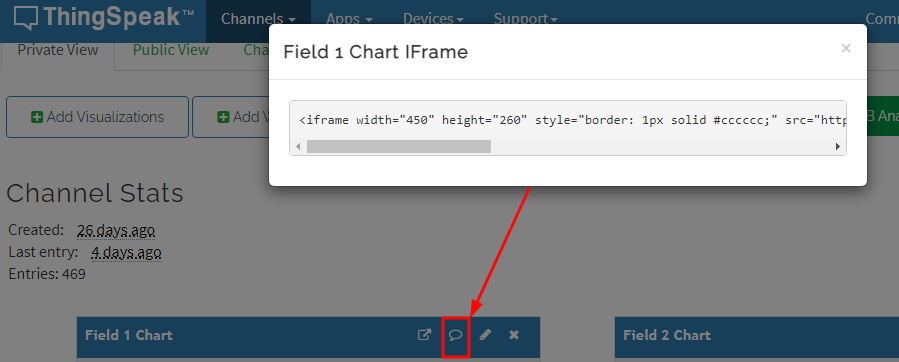

## thingspeak

Thingspeak (https://thingspeak.com) es un proyecto open source (https://github.com/iobridge/thingspeak) creado en 2010. Actualmente, está integrado con el software MATLAB de MathWorks al punto que hay que crear una cuenta en MathWorks para usar la plataforma en thingspeak.com. 

Para usar esta alternativa hay que: 

1. Comenzar siguiendo los pasos que se explican en https://la.mathworks.com/help/thingspeak/collect-data-in-a-new-channel.html.

2. Crear un channel y configurarlo para recibir dos "Fields", uno va a contener la lectura de CO2 y otro la temperatura del sensor.

3. Editar el código del programa correspondiente, indicando tu "Write API Key" en thingspeak. Son 16 números y letras, tachados por seguridad en la figura.

4. Configurar el ESP32 con ese programa. 

El medidor en funcionamiento va a comenzar a enviar datos a la plataforma thingspeak. Vas a poder configurar visualizaciones de manera más o menos intuitiva de manera que veas algo así:

Licencia seleccionada: FREE (For small non-commercial projects)

  - Scalable for larger projects:   No. Annual usage is capped.
  - Number of messages:             3 million/year (~8200/day)
  - Message update interval limit:  Every 15 seconds 
  - Number of channels:             4
  - MATLAB Compute Timeout:         20 seconds
  - Number of simultaneous MQTT subscriptions: Limited to 3
  - Private channel sharing:        Limited to 3 shares
  - Technical Support:            	Community Support 

Para tener más nivel de servicio (conectar más sensores, compartir con más gente, mejores tasas de datos, etc.), hay que adquirir alguna licencia de pago: Standard, Academic, Student, o Home.

### ¿Cómo crear un dashboard sencillo para ver la telemetría de todos los sensores en una página web?

En breve te explicamos cómo hacerlo.

## Embebiendo Dashboards de Thingspeak
Si queremos agregar un dashboard o cuadro de visualización de una medición, dentro de una pagina web debemos embeber una porción de código. Para realizarlo dentro de thingspeak.com con nuestra cuenta y nuestro canal que queremos mostrar, debemos seleccionar el dashboard que queremos mostrar y debemos seleccionar el icono que se muestra a continuación: 

---

## Google Cloud IoT Core

Implementar una aplicación en la plataforma IoT de Google puede ser una tarea compleja. Los programas básicos para el medidor de CO2 van quedar a una distancia de esta aplicación avanzada pero los beneficios, si son necesarios, compensan el esfuerzo:

- Seguridad de los dispositivos mediante autenticación con clave pública (o asimétrica).

- Administración de dispositivos.

- Over The Air Updates (OTA). Aunque Google no lo provee de manera directa, es un requisito importante para el despliegue de dispositivos.

Esta parte del proyecto está pensada para informáticos con cierta experiencia. Lo primero es leer y realizar los pasos indicados en esta [guía de inicio](https://cloud.google.com/iot/docs/how-tos/getting-started). En esa guía se comienza creando una cuenta que permite disponer de un período de evaluación de 90 días. Luego: 

- Se crea un registro de dispositivos

- Se crean las credenciales de cada dispositivo (par clave pública y clave privada)

- Se agregan dispositivos al registro

Con eso ya se puede implementar la aplicación en los medidores, para que envíen la telemetría que se podrá visualizar.

#### Más información

- [Ejemplo](https://github.com/espressif/esp-google-iot/blob/master/examples/smart_outlet/README.md) para comenzar a usar ESP32 en Google Cloud IoT Core.

- Un video en youtube sobre [lo básico de Google Cloud](https://youtu.be/GKEk1FzAN1A).

- Getting started with the [IoT Core Embedded C SDK](https://cloud.google.com/community/tutorials/embedded-c-getting-started).
