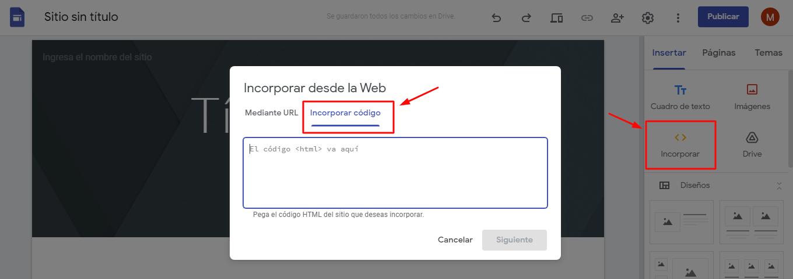

## thingspeak

Thingspeak (https://thingspeak.com) es un proyecto open source (https://github.com/iobridge/thingspeak) creado en 2010. Actualmente, está integrado con el software MATLAB de MathWorks al punto que hay que crear una cuenta en MathWorks para usar la plataforma en thingspeak.com. 

Para usar esta alternativa hay que: 

1. Comenzar siguiendo los pasos que se explican en https://la.mathworks.com/help/thingspeak/collect-data-in-a-new-channel.html.

2. Crear un channel y configurarlo para recibir dos "Fields", uno va a contener la lectura de CO2 y otro la temperatura del sensor.

3. Si ya seguiste los [pasos](https://github.com/medicionco2/proyecto_medidor_co2#programaci%C3%B3n) de las versiones básicas, ya tenías cargada la librería del sensor. Ahora, tenés que cargar la librería thinkspeak que está disponible en el repositorio de Arduino.

4. Editar el archivo secrets.h, que debe incluirse en el IDE de Arduino, indicando tu "Channel Id" y tu "Write API Key" en thingspeak. Los API Key son 16 números y letras, tachados por seguridad en la figura.

5. Configurar el ESP32 con ese programa. 

El medidor en funcionamiento va a comenzar a enviar datos a la plataforma thingspeak. Vas a poder configurar visualizaciones de manera más o menos intuitiva de manera que veas algo así:

Licencia seleccionada: FREE (For small non-commercial projects)

  - Scalable for larger projects:   No. Annual usage is capped.
  - Number of messages:             3 million/year (~8200/day)
  - Message update interval limit:  Every 15 seconds 
  - Number of channels:             4
  - MATLAB Compute Timeout:         20 seconds
  - Number of simultaneous MQTT subscriptions: Limited to 3
  - Private channel sharing:        Limited to 3 shares
  - Technical Support:            	Community Support 

Para tener más nivel de servicio (conectar más sensores, compartir con más gente, mejores tasas de datos, etc.), hay que adquirir alguna licencia de pago: Standard, Academic, Student, o Home.

### ¿Cómo crear un dashboard sencillo para ver la telemetría de todos los sensores en una página web?

A continuación te explicamos cómo hacerlo.

#### Embebiendo Código de Cuadros de Medición y Visualización de Thingspeak

Si queremos agregar un cuadro de visualización de una medición dentro de una página web, debemos embeber una porción de código html. Para realizarlo, dentro de thingspeak.com con nuestra cuenta y nuestro canal que queremos mostrar, debemos seleccionar el cuadro del campo ("Field") que queremos mostrar y debemos seleccionar el icono que se muestra a continuación: 

Una vez seleccionado el icono tendremos acceso a copiar el código a embeber, se trata de una etiqueta iframe que puede agregarse en cualquier sitio web. Si aún no tenemos un sitio web, podemos pegar ese código en un archivo y pasar al paso de crear un sitio web.

#### Creando un sitio web en Google Sites

Si disponemos de una cuenta de gmail, podemos desarrollar un sitio web que estará alojado en Google, accesible por cualquier persona.
Una vez iniciada nuestra cuenta de gmail, se puede acceder a https://sites.google.com/ para comenzar a costruir un sitio web.

Una vez que se ingresa al inicio de la construcción de nuestro sitio en Google, se puede agregar un título a nuestra página, bloques de estructra, estilos, etc. Aquí lo importante es que para mostrar nuestras mediciones debemos agregar un bloque que permita pegar nuestro código de thingspeak. Ese bloque que permite introducir códgo html, se puede agregar como indica la figura, cliqueando en "Incorporar <>" y luego dentro del cuador de diálogo seleccionando "Incorporar código" nos permite en el casillero de texto pegar nuestro código generado desde thingspeak para nuestro cuadro de medición y visualización.

Luego para finalizar podemos hacer más ajustes de alineación y estilo de nuestra página y publicarla. Si en esa misma página queremos mostrar otro gráfico,y esa es la idea de un dashboard, o cuadro de control, repetimos los pasos anteriores.

## Autodescubrimiento de la red WiFi

En versiones de firmware simples, el nombre de la red WiFi (conocido como SSID) y la contraseña, se proporcionan en el programa, en nuestro caso, en el archivo secrets.h. Si se cambia el router, o se lleva el medidor a otra red, hay que volver a editar secrets.h y reprogramar el medidor. Eso, por un lado es incómodo para los usuarios, y por otro lado complica el despliegue en instituciones que necesiten de un número relativamente grande de medidores. Una solución es agregar una funcionalidad que se llama autodescubrimiento de la red WiFi (o WiFi provisioning).

Esta técnica va a permitir distribuír medidores ya programados, de manera que sean más sencillos de usar para los usuarios finales. Sin embargo, para quienes quieran estudiar el programa, van a encontrarse con un código más complejo que en el caso simple de arriba.

WiFi provisioning es un proceso que va a servir para cargar en el medidor- sin tener que programar- el SSID, password, e información para enviar los datos a la plataforma IoT, en este caso Thingspeak. Esta funcionalidad es muy útil en dispositivos IoT como nuestro medidor. El medidor va a poder estar en uno de dos modos: con la configuración cargada o sin la configuración cargada. Si la configuración no está cargada, el medidor se va a comportar como un Access Point y lo vamos a ver entre las redes WiFi disponibles, caso contrario el medidor se conecta a la red que tiene configurada y opera normalmente midiendo y enviando datos a la plataforma IoT.

Para usar el medidor con esta funcionalidad hay que hacer los tres primeros pasos (1-3) de las instrucciones de aquí arriba, luego:

4. Configurar el ESP32 con el programa correspondiente (Thingspeak_WiFi_provisioning.ino). En este punto, se le puede entregar el medidor a un usuario final que solamente va a tener que realizar el quinto paso sin tener que programar lidiar con tecnología. 

5. El medidor en funcionamiento va a enviar datos a la plataforma thingspeak como antes. Pero para que ello ocurra, primero lo vas a tener que configurar del siguiente modo:

  - Durante el primer arranque del dispositivo, el medidor se configura como un punto de acceso (AP - Access Point) y crea una red abierta Wifi sin contraseña con el nombre "redmedidor". Entonces, para establecer la conexion con el punto de acceso, en el dispostivo desde el que se desee conectar al medidor (teléfono, PC, etc.) se debe seleccionar esa red con el nombre "redmedidor". 

(Agregar figura)

  - Esta red abierta WiFI permite al usuario conectarse al medidor a través de un navegador. Para ello, debe ingresarse la dirección http://192.168.4.1 en el navegador para acceder a la página web de configuración.

(Agregar figura)

  - Una vez seleccionado el nombre de red, contraseña, y demás información, el medidor se reinicia e intenta conectarse a la red asignada.

  - Si se establece la conexion el proceso de provisioning se ejecutó exitosamente.

  - En caso de falla o si se quiere modificar la red a la cual se conecta el medidor, se debe pulsar el botón por más de tres segundos para que el dispositivo pase nuevamente al modo de punto de acceso. 
